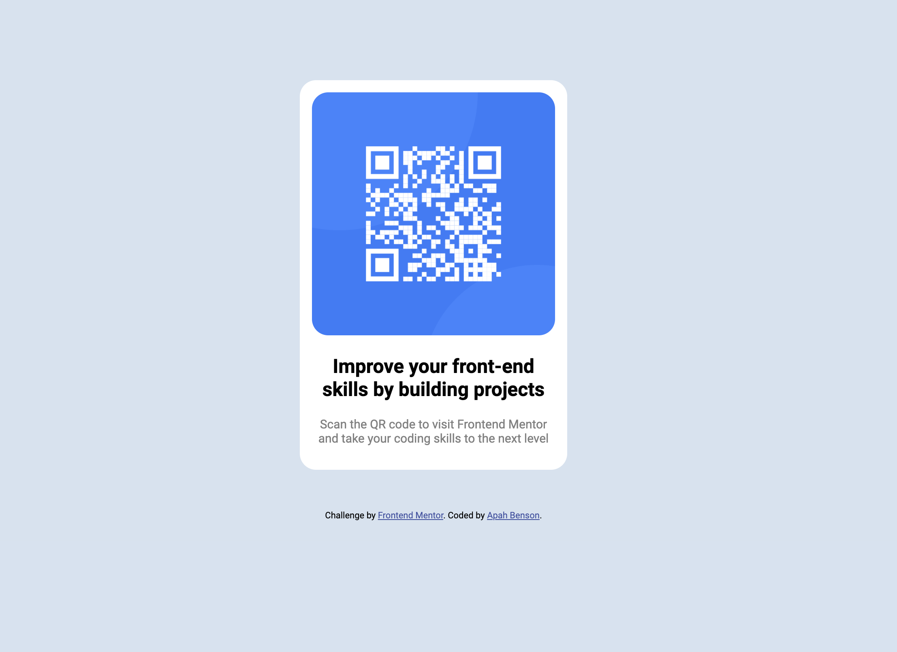

# Frontend Mentor - QR code component solution

This is a solution to the [QR code component challenge on Frontend Mentor](https://www.frontendmentor.io/challenges/qr-code-component-iux_sIO_H). Frontend Mentor challenges help you improve your coding skills by building realistic projects.

## Table of contents

- [Overview](#overview)
  - [Screenshot](#screenshot)
  - [Links](#links)
- [My process](#my-process)
  - [Built with](#built-with)
  - [What I learned](#what-i-learned)
- [Author](#author)

## Overview

### Screenshot



### Links

- Solution URL: [Add solution URL here](https://your-solution-url.com)
- Live Site URL: [Add live site URL here](https://your-live-site-url.com)

## My process

### Built with

- Semantic HTML5 markup
- CSS custom properties

**Note: These are just examples. Delete this note and replace the list above with your own choices**

### What I learned

Learnt how to reduce my code to the bearest minimum requirement
Learnt that i didn't require a grid or flexbox to create the entire content which i ended up developing with a simple div and using the margin auto property for the left and right sides to centeralize the box.
Text-align was used to centralize the texts within the div.

Learnt how to use the margin auto to align the contents of a simple div to the center of the page.

`````css
.container {
  margin: 100px auto;
}
````css
.container {
  width: 300px;
}

### Continued development

I'd really like to focus more on learning how to precisely include code that is necessary and remove the one that isn't. The biggest take away from this project was adding unnecessary tags/elements and finding out they do nothing to help accomplish my goal.

## Author

- Frontend Mentor - [@apah-dev](https://www.frontendmentor.io/profile/apah-dev)
- Twitter - [@benson_apah](https://www.twitter.com/benson_apah)
`````
